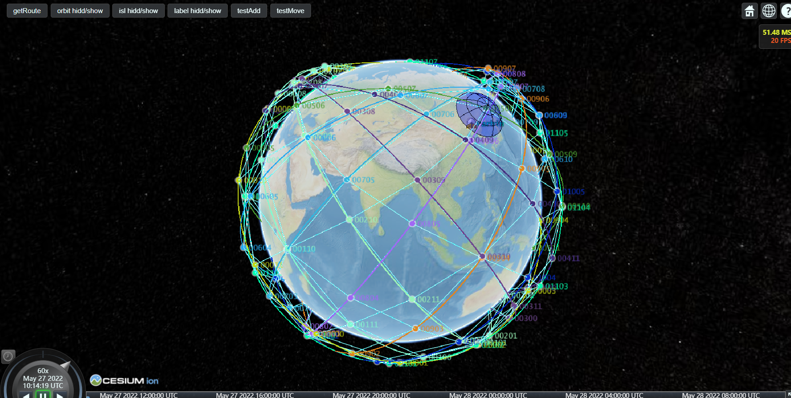
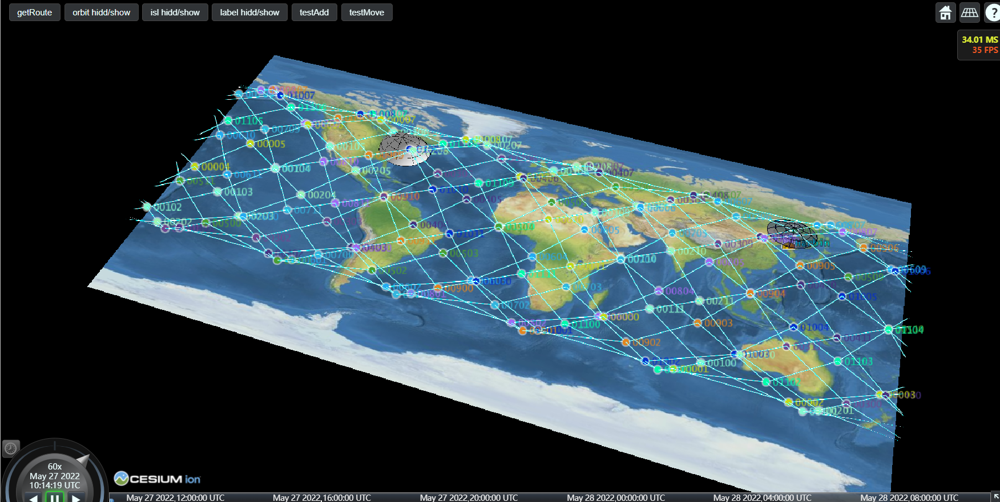

# visualizer
visualizer of satellite network, mininet-space

### 参与实体(Entities)
具有多个实体,分别是:

- lines
  - ISLs
  - 轨道
  - 路由
- nodes
  - 卫星
  - 地面站
  - 移动终端
- 其他
  - 地面站信号范围
  - 卫星信号范围
  
其中,ISLs和路由需要多个entities协作\ref,无法将其分开为独立文件

### 功能特性

1. 网络

2. 分析

  - 任选两点,计算出ACCESS信息(STK专长)

### 特性更新

 **ACCESS功能**: Entity A, 例如GS、Terminal等，进入到entity B（STK中Sensor的抽象）的范围内, 并且得到一定响应. Sensor需要时刻知道范围内有哪些实体,然后采取策略或者动作. 这对天地链路的建立和切换, 检查两个实体是否在通信范围内等具有重要意义.

 实际情况中, 可以通过信号的强度来实现.

 模拟环境中, 有以下办法仿真来得到B范围内的所有实体:

 1. 每个时隙,将B和所有节点位置两两计算,然后过滤. 该方法所有过程均在内存中, 构建好场景后,access需要实时跟随场景一起运算.
好处就是实时,而且支持节点的任意**随机运动**,缺点就是计算密度太大,如果计算一个实体的B对其他n个实体As的ACCESS, 持续m个时隙,就需要O(mn)的复杂度来计算ACCESS数据, 写作Access(t) = **a**, **a**是一个n维向量. 而且如果B能够相关的实体只有很少一部分, which is最常见的情况例如接收机天线范围内的sat只占总体很小一部分, 这种方法还是需要对所有其他实体全部计算一遍,然后检验距离,并不经济.

 1. 在规划好实体A的运动过程后, 增加计算B-A的access过程,得到Access(t) = **b**数据,**b**是一个k维向量,里面的每个维度代表着和B 范围内的实体,且n>>k, 复杂度是O(mk). 对齐到场景,顺便单独形成ACCESS文(t)文件,或者ACCESS计算的引导文件(类似STK中的*.sca文件).在下次启动的时候,可以载入引导文件, 重新计算一遍放在内存里,这在开始启动的时候会预先一段时间的计算;也可以直接载入Access(t)文件到内存.
好处就是效率高,无论是访存还是计算的密度都要低, 缺点就是物体运动必须规划好. 然而, 在空间运动中, 物体运动具有很强的可预测性,因此**比较合适**.

由于前端的计算不适合太高, access(t)也可以由后端计算,留给浏览器共享内存访问.

### 前端的交互

框架略

暂时通过ajax来与后端交互路由信息(*.json)等

### 目前功能

